**什么是网络唤醒**

网络唤醒（Wake-on-LAN，WOL）是一种计算机局域网唤醒技术，使局域网内处于关机或休眠状态的计算机，将状态转换成引导（Boot
Loader）或运行状态。

**一、电脑设置**

**1、设置主板bios**

进入BIOS设置，Power-\>Automatic Power On里面，设置Wake on LAN =
Enable/Automatic，不同机器的BIOS设置位置不同，找到对应的Wake on
LAN选项设置就OK。

一般2010年后的网卡都支持网卡唤醒功能，如果在BIOS设置里面找不到相应的设置项，很可能默认就是开启的。

**2、修改网卡**

进入网卡设置，我的电脑-\>右键”管理“-\>设备管理器-\>网络适配器，找到对应的网卡右键”属性“-\>电源管理，勾选允许此设备唤醒计算机和子选项（只允许幻数据包唤醒计算机），”高级“选项卡里面，检查属性里的唤醒幻数据包=已启用
and 唤醒模式匹配=已启用。

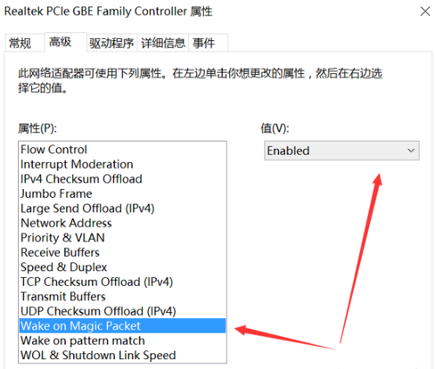

以上配置完后使用唤醒软件工具在局域网中就可以远程唤醒主机。如果需要通过因特网远程唤醒，还需要进行一下操作，绝大部分人使用的网络都是运行商分配的动态IP，所以需要注册一个域名，映射到路由器。

**二、注册域名**

有很多服务商提供域名注册，小米路由器支持一下几个域名服务商，我选择在花生壳注册一个免费的域名。

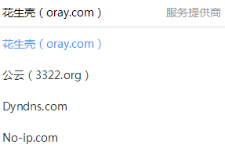

**三、设置路由器**

**1、升级路由器ROM**

更新路由器版本为开发版ROM，后面开启ssh服务会用到，如果最新版本设置不成功，还需要降低ROM版本，实际操作中我也是先降到2.1.6版本配置完后，再升级到最新版的ROM，不影响已开启的ssh服务、设置的ddns、端口转发规则等。

**2、设置ddns**

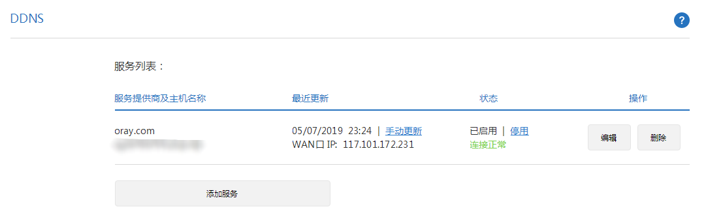

**3、设置端口转发**

切记添加完端口转发规则后，一定要保存并生效。

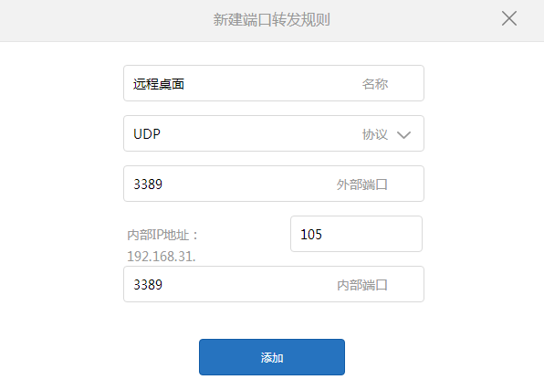

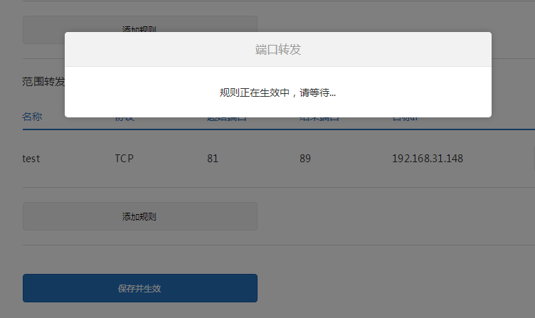

**4、设置DHCP静态IP地址分配**

设置静态IP地址分配目的是防止以后使用过程中电脑的ip发生变化导致连接失败的问题。

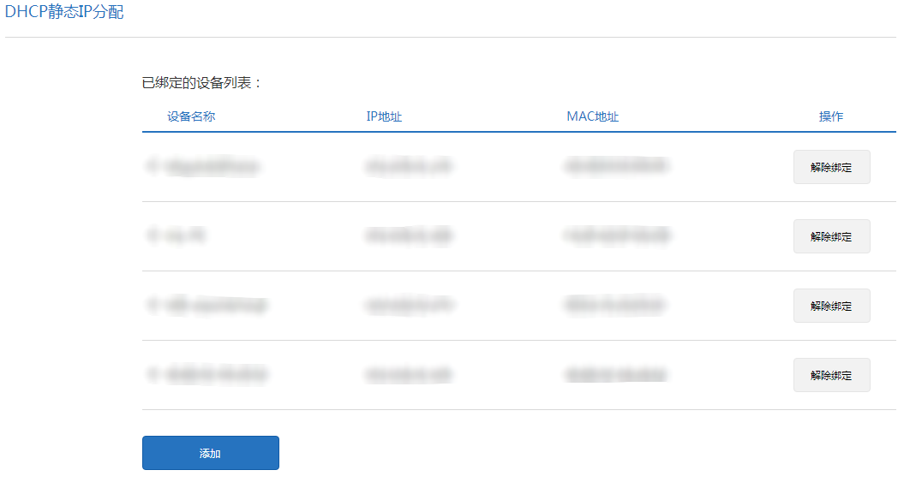

**5、开启路由器ssh端口**

为什么要开启ssh服务?

配置到这里，已经可以通过因特网发送唤醒数据包到我的电脑，电脑关机后两分钟内可以再次唤醒，但是超过2分钟，唤醒操作失败，原因就是路由器arp映射表动态更新后把关机电脑的arp项删除了，导致路由器接收到魔术包后不能正确的转发。

开启ssh服务也是个很大的坑，网上有很多教程，但是目前看来使用U盘开启ssh的方法已经失效了，另一种方法是通过浏览器配置开启ssh服务，如下：

**（1）用浏览器登陆小米路由器后台 **

地址栏一般是这样，注意地址栏路径的STOK，这个参数很重要，后面经常要用到

http://192.168.31.1/cgi-bin/luci/;stok=[你的stok]/web/home\#router

**（2）获取ssh端口**

修改以下四条命令的stok值为你的stok，依次放入浏览器地址栏执行，前三条命令顺利的话应该返回{"msg":"未能连接到指定WiFi(Probe
timeout)","code":1616}，如果不是这个结果可以重来一遍，直到返回结果是这个为止。最后一条命令应该返回的结果是{"code":0}。

新旧密码也可以一样的，ssid不需要设置为你路由器的ssid。

命令执行结果可能返回1617、1523，原因可能是路由器ROM版本太高，或者命令中的参数有问题。

http://192.168.31.1/cgi-bin/luci/;stok=ba66652c33a114ba0bf231f10c308a7a/api/xqnetwork/set_wifi_ap?ssid=Xiaomi\&encryption=NONE&enctype=NONE&channel=1%3Bnvram%20set%20ssh%5Fen%3D1%3B%20nvram%20commit

http://192.168.31.1/cgi-bin/luci/;stok=ba66652c33a114ba0bf231f10c308a7a/api/xqnetwork/set_wifi_ap?ssid=Xiaomi&encryption=NONE&enctype=NONE&channel=1%3Bsed%20%2Di%20%22%3Ax%3AN%3As%2Fif%20%5C%5B%2E%2A%5C%3B%20then%5Cn%2E%2Areturn%200%5Cn%2E%2Afi%2F%23tb%2F%3Bb%20x%22%20%2Fetc%2Finit.d%2Fdropbear

http://192.168.31.1/cgi-bin/luci/;stok=ba66652c33a114ba0bf231f10c308a7a/api/xqnetwork/set_wifi_ap?ssid=Xiaomi&encryption=NONE&enctype=NONE&channel=1%3B%2Fetc%2Finit.d%2Fdropbear%20start

http://192.168.31.1/cgi-bin/luci/;stok=ba66652c33a114ba0bf231f10c308a7a/api/xqsystem/set_name_password?oldPwd=你的旧密码&newPwd=你的新密码

**（3）通过ssh登录路由器**

这时候应该已经可以用SSH访问路由器了。然后需要一个可以SSH到Linux的软件，可以是putty也可以是secureCRT，或者其它的工具。用户名是root，密码是你上面命令里设置的。

登录成功后，你就会看到雷布斯的are you ok！

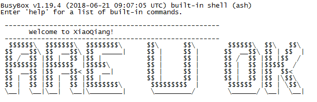

**6、设置arp静态绑定mac**

通过ssh工具登录到路由器，下面这个指令可以设置静态的arp表项。

arp -s ip地址 ma地址

但是路由器重启后就会丢失，如果不增加静态表项，关机后可以看到

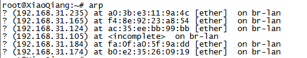

所以我们把这条指令写到启动脚本rc.local里面。

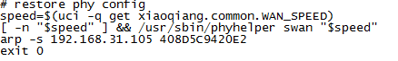

修改完后，重启路由器，输入arp命令，我们可以看到一条静态的表项，192.168.31.105。

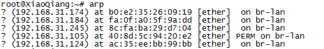

到这里所有的操作就结束了，你可以自由的远程操控你的电脑了。

**7、通过远程桌面连接登录你的电脑**

你可以动过域名来访问你的电脑。

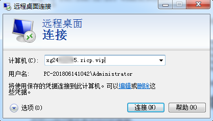

**四、唤醒软件**

网上有很多wol远程唤醒的软件，但是大多数都是在局域网使用的，有一个web网站还不错（*https://www.depicus.com/wake-on-lan/woli*），但我觉的操作起来还是不太方便，每次都要重新填写，于是自己写了一个小工具，如下，在配置文件里面设置好电脑的mac地址、域名、端口号后，以后就不用再设置了。需要说明的是如果域名解析正确的话就按照域名访问你的电脑，如果域名解析不正确或者填写空白，则通过ip地址访问你的电脑，这样可以方便在局域网和广域网两种环境下使用。
如果你发现从DNS解析的IP地址不正确，请使用ipconfig /flushdns 更新dns缓存。

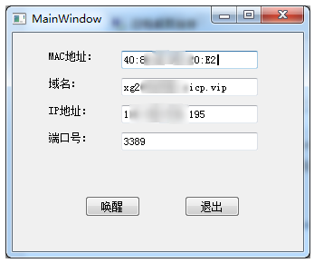
